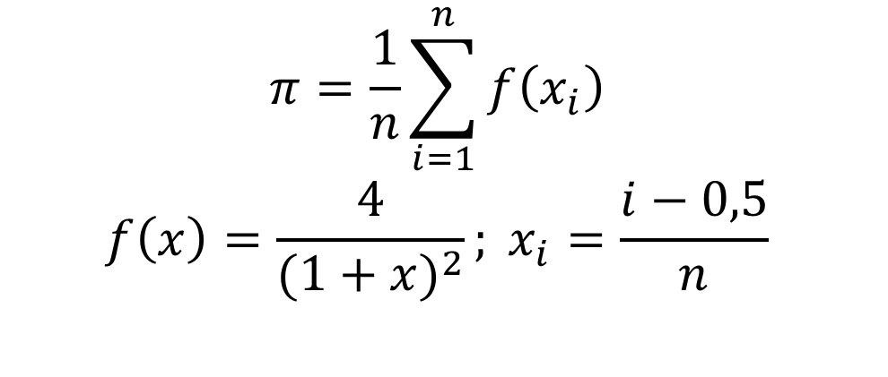

# Тест №1
## Тест на OpenMP и MPI в рамках курса "Высокопроизводительные и распределенные системы" ВШ ИТИС КФУ

###Описание теста

1. Модификация последовательного кода для параллельного выполнения
2. Создание гибридного кода для решения математической задачи

###Модификация последовательного кода
Задача - модифицировать код, для достижения максимального быстродействия.
Добавить вывод времени исполнения параллельного и последовательного кода.

###Создание гибридного кода
Создать код вычисляющий число &pi; по формуле

###Порядок выполнения работы
1. Форкаете репозиторий
2. Клонируете репозиторий на машину
3. Изменяете файлы в соотвествии с заданием
4. Пушите изменения на Гитхаб
5. Создаете пул реквест в изначальный репозиторий для сдачи задания
6. ???
7. PROFIT
